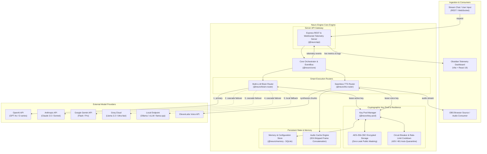

# Neuro Engine

[](https://github.com/stenlysayd/neuro-engine/actions/workflows/ci.yml)
[](LICENSE)
[](tsconfig.base.json)
[](pnpm-lock.yaml)

A high-resilience, modular **Multi-LLM Orchestration Engine** engineered for autonomous AI agents, streaming companions, and real-time developer workflows.

Neuro Engine solves the fragility of relying on single LLM providers and single API keys by introducing **AES-256 encrypted key pool leasing**, **automatic multi-provider cascade failovers**, **sentence-chunked audio synthesis with ID3 frame stripping**, and **real-time WebSocket telemetry monitoring**.

---

## 🏗️ System Architecture



---

## 📦 Monorepo Packages

Built as a strict modular TypeScript monorepo with high separation of concerns:

| Package | Version | Description |
| --- | --- | --- |
| [**`@neuro/core`**](packages/core) | `1.0.0` | Shared interfaces, cryptographic primitives (AES-256-CBC encryption/decryption, secret masking), and global EventEmitter bus. |
| [**`@neuro/memory`**](packages/memory) | `1.0.0` | Persistent storage backed by SQLite (`better-sqlite3`), handling migration tables, system settings, and conversation context. |
| [**`@neuro/key-pool`**](packages/key-pool) | `1.0.0` | High-availability key leasing manager with automatic rotation, rate-limit cooldowns, usage tracking, and security masking. |
| [**`@neuro/brain-router`**](packages/brain-router) | `1.0.0` | Multi-LLM adapter cascade router supporting OpenAI, Anthropic, Google Gemini, Groq, and local Ollama/vLLM endpoints. |
| [**`@neuro/tts-router`**](packages/tts-router) | `1.0.0` | Sentence-level stream chunker with ID3 metadata header/trailer stripping for seamless audio concatenation without playback glitching. |
| [**`@neuro/api`**](packages/api) | `1.0.0` | Headless backend providing REST management endpoints and WebSocket streaming for real-time telemetry and state replication. |
| [**`@neuro/dashboard`**](packages/dashboard) | `1.0.0` | High-polish dark-mode (Obsidian theme) telemetry dashboard for live key pool inspection, router cascade tuning, and usage metrics. |

---

## ✨ Key Capabilities

### 1. Zero-Downtime Multi-LLM Cascading
Never fail on an API outage or exhausted quota. If your primary provider (e.g. OpenAI) returns a `429 Too Many Requests`, `503 Service Unavailable`, or invalid response, the **Brain Router** automatically falls over to the next priority provider in the cascade (e.g. Anthropic Claude → Google Gemini → Groq → Local Ollama) within milliseconds, logging the transition to the telemetry bus.

### 2. Cryptographically Secure Key Pool
- **AES-256-CBC Encryption**: Keys are encrypted with a unique random IV before touching SQLite. The master key never touches the database.
- **Zero-Leak API Contracts**: Responses to the dashboard or logs always mask secrets (`sk-ant-***...3a9f`) and identify keys through cryptographically salted fingerprints.
- **Circuit Breaker & Cooldown**: Keys that hit rate limits or errors are quarantined for a configurable rest interval before re-entering the lease pool.

### 3. Glitch-Free Audio Frame Synthesis
Traditional chunked TTS produces distinct MP3 files with ID3 headers and trailers, creating audible pops or clicks when played sequentially. Neuro Orchestrator implements an **ID3 frame stripper** that slices raw MP3 audio frames and concatenates them seamlessly into a continuous stream.

### 4. Real-Time Telemetry & Operations Dashboard
Includes an integrated React 19 dashboard styled with an obsidian theme:
- Real-time token consumption & character rate counters.
- Latency benchmarks per model & provider.
- Interactive key rotation modal with batch-key import.
- Live cascade routing configuration.

---

## 🚀 Quick Start

### Prerequisites
- Node.js `20.x` or `22.x`
- pnpm `9.x` (`npm install -g pnpm`)

### 1. Installation
```bash
git clone https://github.com/stenlysayd/neuro-engine.git
cd neuro-engine
pnpm install
```

### 2. Environment Configuration
```bash
cp .env.example .env
```
Generate and configure a secure 32-byte `MASTER_KEY` in `.env`:
```bash
node -e "console.log(require('crypto').randomBytes(32).toString('hex').slice(0,32))"
```

### 3. Build All Packages
```bash
pnpm run build
```

### 4. Start the Application
Start the backend server and frontend dashboard:

```bash
# Terminal 1: Backend API (port 3001)
pnpm --filter @neuro/api start

# Terminal 2: Telemetry Dashboard (port 5173)
pnpm --filter @neuro/dashboard dev
```

Open [http://localhost:5173](http://localhost:5173) to access the operations dashboard.

---

## 🔒 Security

All credentials are treated as zero-trust at rest and in transit. For vulnerability disclosures or security questions, please consult [SECURITY.md](SECURITY.md).

---

## 🤝 Contributing

Contributions are welcomed! Check out [CONTRIBUTING.md](CONTRIBUTING.md) for monorepo guidelines and pull request checklists.

---

## 📄 License

This project is licensed under the [MIT License](LICENSE) © 2026 [Stenly Sayd](https://github.com/stenlysayd).
